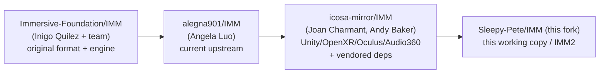
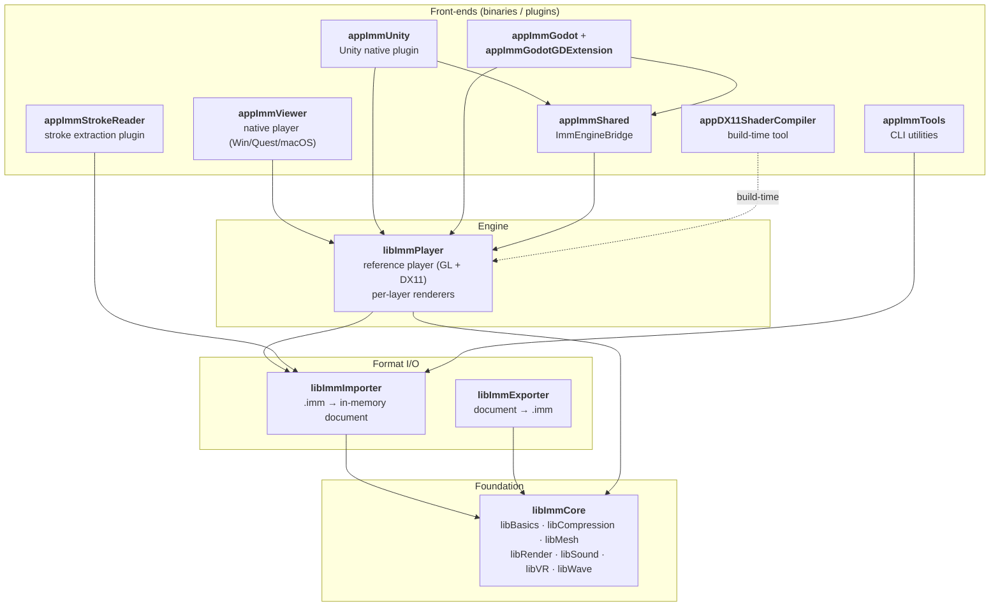
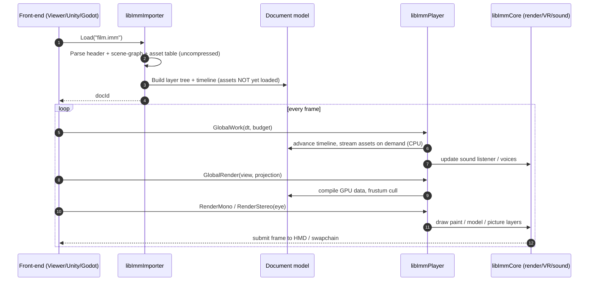

# 1. Overview & Module Map

## 1.1 What problem IMM solves

Traditional film and 3D animation flatten to 2D pixels at delivery. For VR storytelling the
viewer is *inside* the scene, so content must stay fully 3D until the moment it's presented.
IMM is a **delivery format** (not an authoring format) that keeps the original 3D nature of the
content — geometry, paint strokes, voxels, 360 panoramas, positioned pictures, spatial audio —
together with a scene graph and an animation timeline, all heavily compressed for streaming.

The analogy the project itself uses: **IMM is to a VR film what JPEG is to an image.** You
author elsewhere (e.g. Quill), export to `.imm`, and play it back. Re-importing `.imm` for
further authoring is explicitly discouraged.

IMM has shipped real films — *Rebels* (Tribeca-nominated), *Tale of Soda Island*, *The Remedy*,
*Goodbye Mr. Octopus*, *4 Stories*, and others.

## 1.2 Fork lineage

This repository is a fork chain. Understanding it explains why so much is vendored:

- **icosa-mirror** added the Unity integration, OpenXR VR, Oculus PC + Platform SDK, Facebook
  Audio360 spatial audio, the runtime layer-control API, chapters/action keyframes, Android/Quest
  builds, non-VR PC controls, and **vendored every dependency** so the Windows build is
  reproducible from a snapshot (some SDKs are now hard to find — Audio360 was pulled by Facebook).
- This fork (`IMM2` working tree) continues from there; per the project memory it is synced to
  `icosa-mirror/main` with the Windows build validated, and `feature/vulkan` + Quest headset work
  queued next.

Source: [`README.md`](../../README.md), [`COMPARISON_UPSTREAM_VS_ICOSA.md`](../../COMPARISON_UPSTREAM_VS_ICOSA.md).

## 1.3 The module map

Everything lives under `code/`. The libraries form a strict dependency stack; the `app*`
front-ends sit on top.

| Module | Type | Role |
|--------|------|------|
| `libImmCore` | library | OS services, math/containers, **renderer abstraction (DX11/GL/GLES/Metal)**, VR/HMD, spatial sound, mesh, compression, WAV/OGG |
| `libImmImporter` | library | Parse `.imm` into an in-memory **document** (scene graph + timeline + assets) |
| `libImmExporter` | library | Serialize a document back out to `.imm` |
| `libImmPlayer` | library | Reference **playback engine**: consumes a document, runs the frame loop, owns per-layer-type renderers, mono + stereo VR |
| `appImmViewer` | binary | Native standalone player (Windows desktop/VR, Quest, macOS-Metal) |
| `appImmUnity` | plugin | `extern "C"` native plugin exposing the player to Unity C# |
| `appImmStrokeReader` | plugin | Exposes **raw paint stroke geometry** without rendering (feeds open-brush-fast / SharpQuill) |
| `appImmGodot` + `…GDExtension` | plugin | Godot 4.x port (C backend + GDExtension C++ bindings) |
| `appImmShared` | library | `ImmEngineBridge` — engine-agnostic init/graphics/lifecycle shared by Unity + Godot |
| `appDX11ShaderCompiler` | tool | Pre-compiles DX11 shader permutations into C++ headers at build time |
| `appImmTools` | tool | CLI utilities (e.g. `ImmPictureScan`) |
| `ImmUnitySampleProject` / `ImmGodotSampleProject` | project | Sample integrations + the UPM packages |

## 1.4 End-to-end data flow

How a `.imm` becomes pixels and sound:

The two-phase split — **GlobalWork (CPU/animation/streaming)** then **GlobalRender + Render
(GPU)** — is the heart of the engine and is detailed in
[05-playback-engine.md](05-playback-engine.md).

## 1.5 Platform / backend matrix

| Platform | Renderer | Audio | VR | Built front-ends |
|----------|----------|-------|----|------------------|
| Windows desktop | DX11 or OpenGL 4.x | DirectSound / DirectSoundOVR (Audio360) | Oculus Rift/RiftS/Quest(Link), HTC Vive | Viewer, Unity plugin, StrokeReader |
| Android / Quest | OpenGL ES | OpenSL ES | OpenXR / Oculus Mobile (VrApi) | Viewer, Unity plugin, StrokeReader |
| macOS | Metal | AVFoundation | — | StrokeReader, Godot, Metal viewer |
| iOS | (minimal, no render) | — | — | StrokeReader (static lib) |

All backend selection happens behind `libImmCore` factory interfaces (`piRenderer::Create`,
`piVRHMD::Create`, `piSoundEngineBackend`) — see [03-libImmCore.md](03-libImmCore.md).

## 1.6 Where to go next

- Want to understand the **data**? → [02-imm-file-format.md](02-imm-file-format.md)
- Want to understand **rendering / VR**? → [05-playback-engine.md](05-playback-engine.md)
- Embedding in **Unity or Godot**? → [06-engine-integrations.md](06-engine-integrations.md)
- **Building** it? → [07-build-system.md](07-build-system.md) + root `BUILDING.md`
