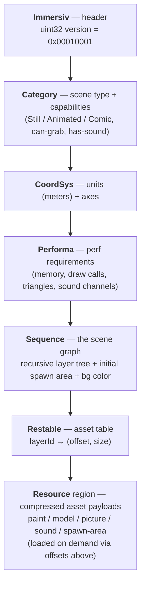
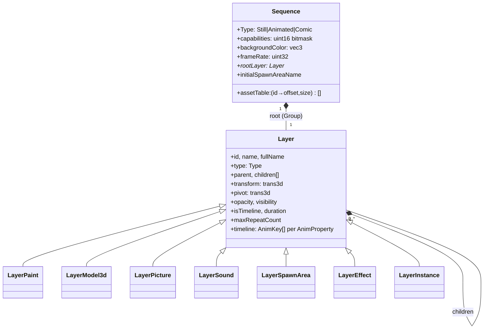
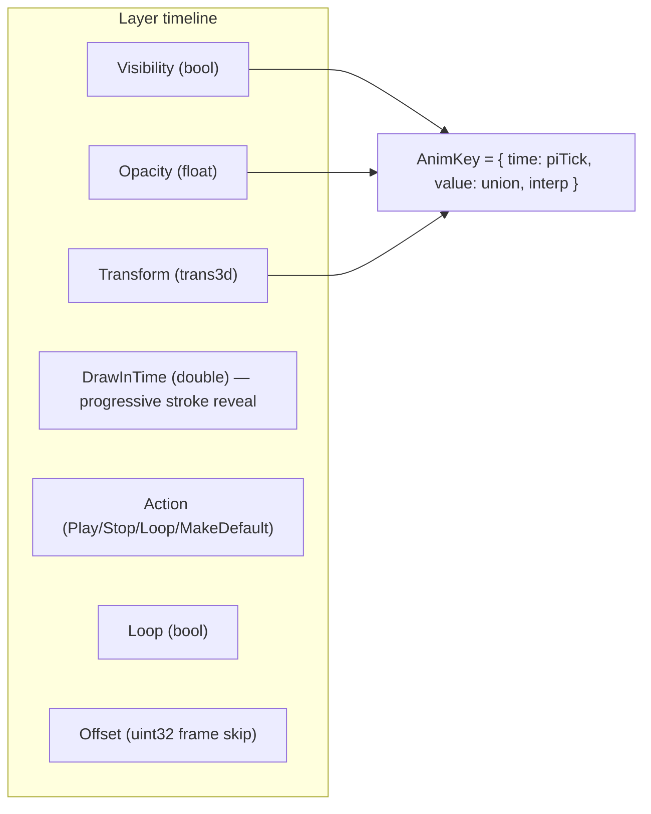
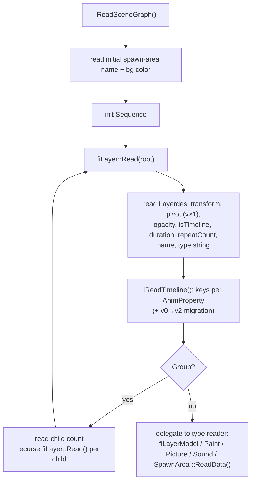
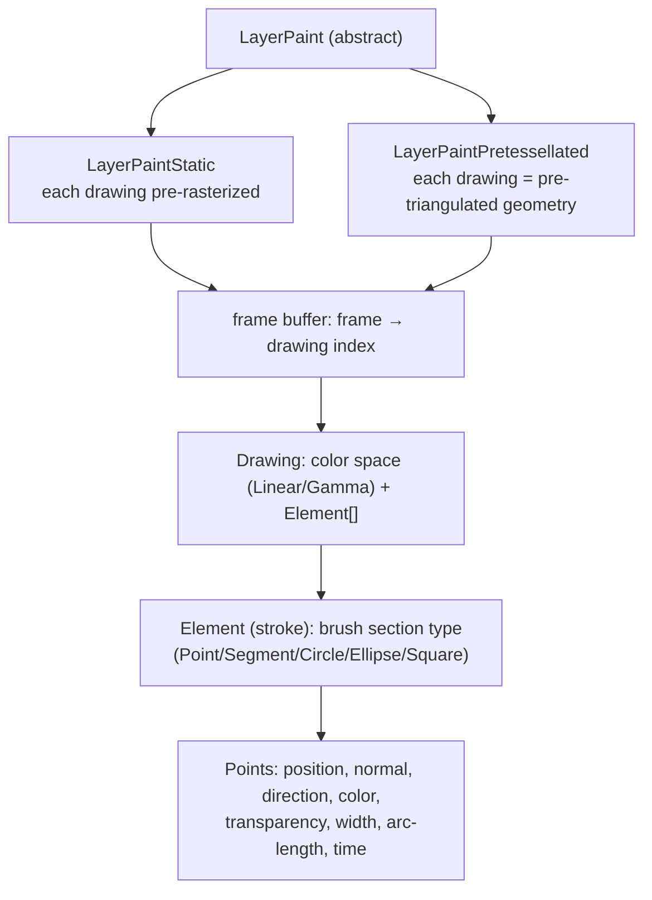

# 2. The `.imm` File Format & Document Model

This is the conceptual centre of the project. Everything else either produces or consumes the
structures described here.

## 2.1 Design principles

- **Two tiers of data.** *Scene-graph and animation metadata* are stored **uncompressed** for
  fast streaming and instant parsing — they're a negligible fraction of file size. *Asset data*
  (paint, models, pictures, audio) is **compressed per container type** with a codec tailored to
  that media.
- **Random-access assets.** Asset payloads are addressed by an offset/size table, so the player
  loads them **on demand** and streams them in/out of memory as the timeline needs them.
- **Per-container versioning.** Each container carries its own version, so the format can evolve
  while staying backward-compatible.

## 2.2 On-disk layout

The file is a sequence of chunks, each introduced by an **8-byte ASCII signature**. The
importer reads them in order; asset payloads referenced by the resource table are loaded lazily.

Signatures observed in the parser (`code/libImmImporter/src/fromImmersive/fromImmersive.cpp`):
`Immersiv`, `Category`, `CoordSys`, `Sequence`, `Restable`, plus `Performa` on the export side
(`code/libImmExporter/src/toImmersive/toImmersive.cpp`). The header version is `0x00010001`
(16.16 = v1.1).

> The scene graph in the `Sequence` chunk is written by a **recursive depth-first** layer
> traversal; reading mirrors it (see §2.6).

## 2.3 The in-memory document model

Once parsed, the file becomes a tree rooted at a `Sequence`:

Defined in `code/libImmImporter/src/document/` — `sequence.h`, `layer.h`, and one
`layer<Type>.h/.cpp` per layer type.

## 2.4 Layer taxonomy

The `Layer::Type` enum (`code/libImmImporter/src/document/layer.h:37`):

| Type | Media | Notes |
|------|-------|-------|
| **Group** | — | Container; holds child layers. The root layer is a Group. |
| **Paint** | Brush strokes | Vector drawing of brush *elements*. Two storage/render modes: **Static** (pre-rasterized) and **Pretessellated** (pre-triangulated mesh). See §2.7. |
| **Effect** | Filter | Blur / color-correct etc., defined in a volume. Minimal implementation. |
| **Model** | 3D mesh | Imported from FBX/OBJ; unlit or smooth shading; optional wireframe. |
| **Picture** | 2D image | Content types: flat `Image2D`, `Image360` equirect mono/stereo, `Image360` cubemap variants. Can be viewer-locked. |
| **Sound** | Audio | Flat (head-locked), Ambisonic (360°), or Positional (3D) with attenuation + directional cone/frustum modifiers. |
| **Reference** | External file | Reference to an external resource. |
| **Instance** | Layer alias | Instanced reference to another named internal layer. |
| **SpawnArea** | Viewpoint | A spawn/view location with a locomotion volume (Sphere/Box), tracking level (Floor/Eye), translation constraints, and a screenshot thumbnail. |

Asset payload formats (`Layer::AssetFormat`): `NONE, PNG, JPG, WAV, OGG, OPUS`.

## 2.5 The animation timeline

Every layer can carry a **timeline**: per-property arrays of keyframes. Time is expressed in
**ticks** (`piTick`, integer arithmetic) rather than frame indices, so playback is frame-rate
independent and free of float drift.

**AnimProperty** values (`layer.h:75`): `Visibility, Opacity, Position, Rotation, Scale,
Transform, DrawInTime, Action, Loop, Offset`. **InterpolationType** (`layer.h:52`): `None,
Linear, Smoothstep, EaseIn, EaseOut, Spline, Auto`.

### Timeline versioning

| Timeline ver | What changed |
|--------------|--------------|
| v0 | No `Loop`/`Offset`; separate `Position` / `Rotation` / `Scale` properties |
| v1 | Adds `Loop` and `Offset` |
| v2 | Unifies `Position`+`Rotation`+`Scale` into a single `Transform` property |

The importer migrates old keys forward: separate P/R/S keys are merged into `Transform` keys on
read (`code/libImmImporter/src/fromImmersive/fromImmersiveLayer.cpp`). This is the canonical
example of how per-container versioning preserves compatibility.

## 2.6 Reading the scene graph (recursive)

Type strings encode origin, e.g. `"Quill.Paint"` → `Layer::Type::Paint`.

## 2.7 Paint layers in depth

Paint is the signature IMM media type and has the richest structure:

Files: `code/libImmImporter/src/document/layerPaint.h`, `layerPaintStatic.*`,
`layerPaintPretessellated.*`, and `layerPaint/{drawing,element}.*`. The choice of Static vs
Pretessellated is a player setting (the "paint technique") and selects a different renderer at
playback time — see [05-playback-engine.md](05-playback-engine.md).

## 2.8 Cross-references

- How these structures are produced/consumed on disk → [04-import-export-pipeline.md](04-import-export-pipeline.md)
- How each layer type is turned into pixels/sound → [05-playback-engine.md](05-playback-engine.md)
- How the stroke data is exposed to other engines without rendering → [06-engine-integrations.md](06-engine-integrations.md) (StrokeReader)
