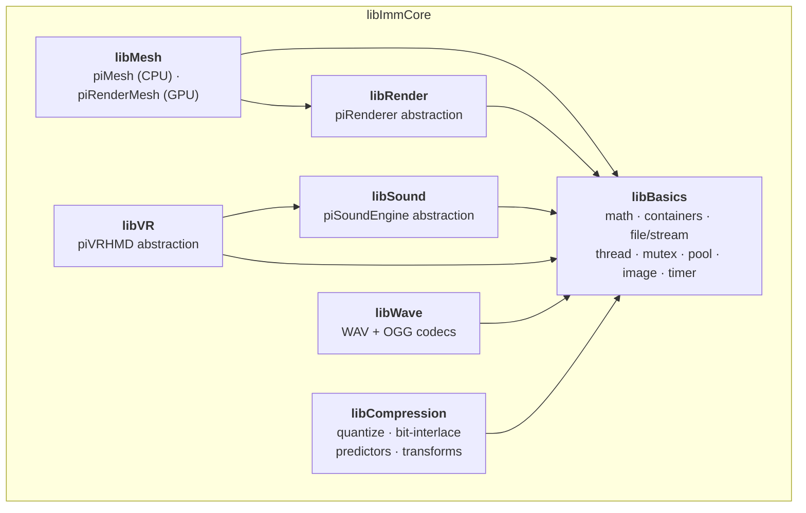
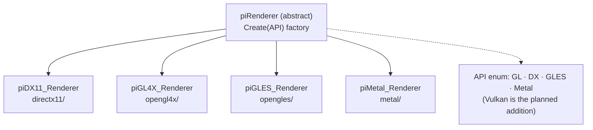
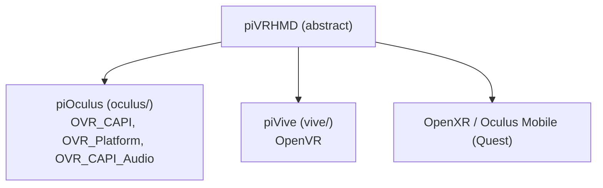
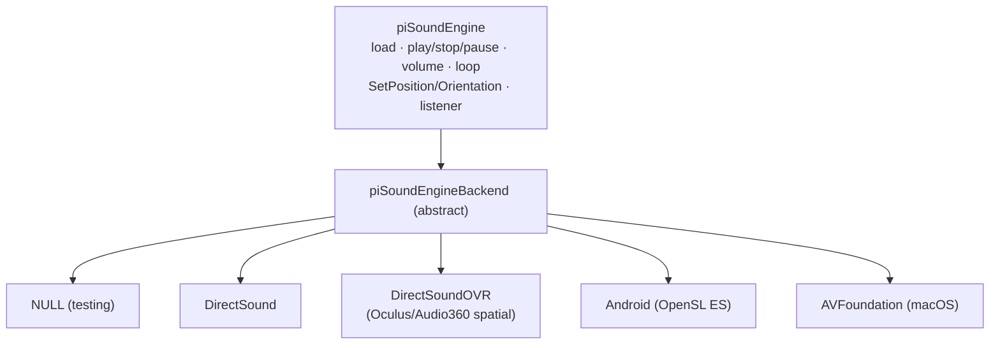

# 3. libImmCore — the Cross-Platform Foundation

`libImmCore` is the bottom of the stack. It provides everything that is *not* IMM-specific:
math and containers, file/stream I/O, threading, a graphics-API abstraction, a VR/HMD
abstraction, a spatial-audio engine, mesh handling, and audio codecs. Every other library and
app depends on it, and it's the layer you touch when porting to a new platform or adding a new
renderer backend (e.g. the planned Vulkan path).

Location: `code/libImmCore/src/`, organised into seven sub-libraries.

The whole library leans on three recurring patterns, worth internalising before reading any of
it:

1. **Opaque handle pattern.** GPU resources (`piShader`, `piTexture`, `piBuffer`,
   `piVertexArray`, `piRTarget`, …) are forward-declared opaque pointers via a macro. Callers
   never see backend types, so DX11/GL/Metal code never leaks into engine code.
2. **Factory + virtual interface.** Each subsystem has an abstract base
   (`piRenderer`, `piVRHMD`, `piSoundEngineBackend`) and a static `Create(API/HwType …)` that
   returns the right platform implementation.
3. **Preprocessor + platform folders.** `windows/ android/ ios/ macos/` subfolders hold OS
   implementations of the same interface, selected by `#ifdef WINDOWS/ANDROID/MACOS/…`.

---

## 3.1 libBasics

The grab-bag foundation. Key headers (`code/libImmCore/src/libBasics/`):

| Header | Provides |
|--------|----------|
| `piVecTypes.h` | The math library — `vec2/3/4`, `ivecN`, matrices, quaternions, `trans3d` spatial transforms. (~168 KB; the workhorse.) |
| `piArray.h` / `piTArray.h` | Dynamic array containers (no STL dependency) with explicit growth semantics |
| `piPool.h` / `piTPool.h` | Pre-allocated object pools for fragmentation-free real-time allocation |
| `piString.h` / `piStr.h` / `piCStr` | String utilities (wide + narrow) |
| `piFile.h`, `piStreamI.h`, `piStreamO.h` | File ops + abstract polymorphic streams (`piIStream`/`piOStream`) used for serialization to file, memory, or custom sinks |
| `piImage.h` | 2D/3D/Cube images with PNG/JPG codecs (up to 16 channels) |
| `piTick.h` | **Integer** frame-rate-agnostic timing (the timeline's clock) |
| `piTimer.h` | High-resolution timer |
| `piThread.h`, `piMutex.h` | Thread + mutex wrappers |
| `piColor.h`, `piSystemInfo.h`, `piWindow.h`, `piLog.h` | Color, platform capability detection, window mgmt, logging |

Platform-specific implementations live in `libBasics/{windows,android,ios,macos}/`.

---

## 3.2 libRender — the renderer abstraction

`piRenderer` (`code/libImmCore/src/libRender/piRenderer.h`) is a virtual base class wrapping a
modern graphics API behind a uniform interface. This is the single most important abstraction
for anyone adding a backend.

What `piRenderer` abstracts:

- **Textures** — 1D/2D/3D/Cube/Array, 44+ formats incl. compressed (DXT1/DXT5)
- **Shaders & programs** — compile + link; DX11 path consumes pre-compiled bytecode (see the
  shader compiler in [07-build-system.md](07-build-system.md))
- **Buffers & vertex arrays** — opaque `piBuffer` / `piVertexArray`
- **Render targets** — incl. MSAA
- **State** — blend / depth / raster / viewport; **viewport arrays** for single-pass stereo
- **Queries** — GPU timing
- **Barriers** — for compute (shader storage, atomics, images)
- **Primitive types** — triangles, patches (tessellation), lines, points, strips

`piRenderMesh` (in libMesh) is the bridge: it takes a CPU `piMesh` and creates the VBO/IBO/VAO
through whichever `piRenderer` is active, then `Render()`s it.

---

## 3.3 libVR — HMD abstraction

`piVRHMD` (`code/libImmCore/src/libVR/piVR.h`) abstracts headsets behind one interface with a
`Create(HwType, …)` factory.

Key concepts exposed:

- **HwType**: `Oculus_Rift, HTC_Vive, SonyVR, Oculus_RiftS, Oculus_Quest, ANY_AVAILABLE`
- **TrackingOrigin**: `FloorLevel` / `EyeLevel`
- **Per-frame data** (`HmdInfo`): head camera/projection, per-eye `EyeInfo` (viewport,
  projection, camera), controller + remote state
- **Input structs**: `Button`, `Touch`, `Joystick` (with swipe detection), full `Controller`
  (pose, velocity, trigger/grip, all buttons/touches), simplified `Remote`
- **TextureChain**: swap-chain support (up to 64 textures/eye) for async timewarp
- **HmdState**: should-quit, worn, visible, lost, tracker connected, position-tracked
- **Render lifecycle**: `BeginFrame` / `EndFrame`, `AttachToWindow`, mirror-texture support
- **Audio + haptics**: `AttachSoundEngine` ties spatial audio to the HMD; haptics via a
  per-controller `std::function` callback

The player drives this interface in its stereo render paths — see
[05-playback-engine.md](05-playback-engine.md) §5.4.

---

## 3.4 libSound — spatial audio engine

Two layers: `piSoundEngine` (the high-level engine) over `piSoundEngineBackend` (the platform
driver).

- **SoundType**: `Flat` (stereo/mono, head-locked), `Ambisonic` (360°), `Positional` (3D
  spatialized). A flat sound can be promoted to positional at runtime.
- **AttenuationType**: `None, Linear, Logarithmic, InverseSquare`
- **ModifierType**: `Cone` (speaker directivity), `Frustum` (stereo speaker pair)
- **Backend config**: maxVoices, sampleRate, bufferSize, low-latency mode, device enumeration

Sources from disk (WAV/MP3), raw PCM, or a callback. The Windows `DirectSoundOVR` path is what
delivers Audio360/Oculus spatial audio.

---

## 3.5 libMesh, libCompression, libWave

- **libMesh** — `piMesh` (CPU: multiple vertex streams with flexible formats, 16/32/64-bit
  indices, triangles/quads, serialization, bounding boxes) and `piRenderMesh` (GPU wrapper that
  builds VBO/IBO/VAO via `piRenderer` and supports zero-copy `UpdateFromMesh`).
- **libCompression** — header-only quantization (`piQuantize`, float ↔ N-bit int 7–23 bits),
  bit interleaving (`piBitInterlacer`), delta/predictive coding (`piPredictors`), and
  `piTransforms`. These are how paint/mesh vertex attributes are packed in `.imm` assets.
- **libWave** — `piWav` container + `formats/piWaveWAV.cpp` (RIFF/WAVE) and
  `formats/piWaveOGG.cpp` (OGG Vorbis), using vendored libogg/libvorbis. (Opus encode for export
  lives in the exporter path with `libopusenc`.)

---

## 3.6 Threading & memory notes

- Threading is deliberately low-level: `piThread` (fn-ptr + `void*`) + `piMutex`. There are no
  higher-level task systems; the player uses a mutex to protect the scene graph between the
  CPU-update and GPU-render phases.
- Containers (`piArray`, `piPool`) avoid the STL and favour explicit, allocation-friendly
  behaviour suited to real-time/VR frame budgets.
- The `piTick` integer clock is what keeps multi-threaded animation frame-accurate without
  float drift.

## 3.7 Porting / extension entry points

| To add… | Start at |
|---------|----------|
| A new GPU backend (e.g. **Vulkan**) | subclass `piRenderer` under a new `libRender/vulkan/`, implement the opaque-handle resource methods, register it in `piRenderer::Create` |
| A new HMD / OpenXR runtime | subclass `piVRHMD`, wire `BeginFrame/EndFrame` + eye/controller data |
| A new audio backend | subclass `piSoundEngineBackend` |
| A new OS | add `libBasics/<os>/` implementations of file/timer/mutex/window/systeminfo |
