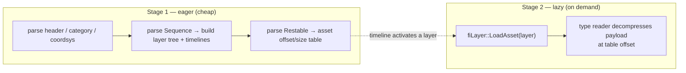
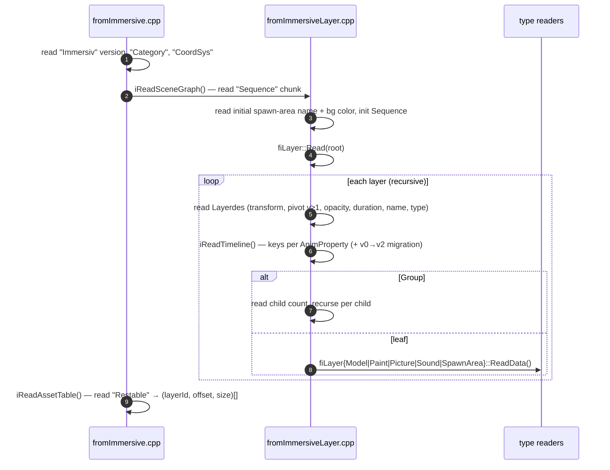
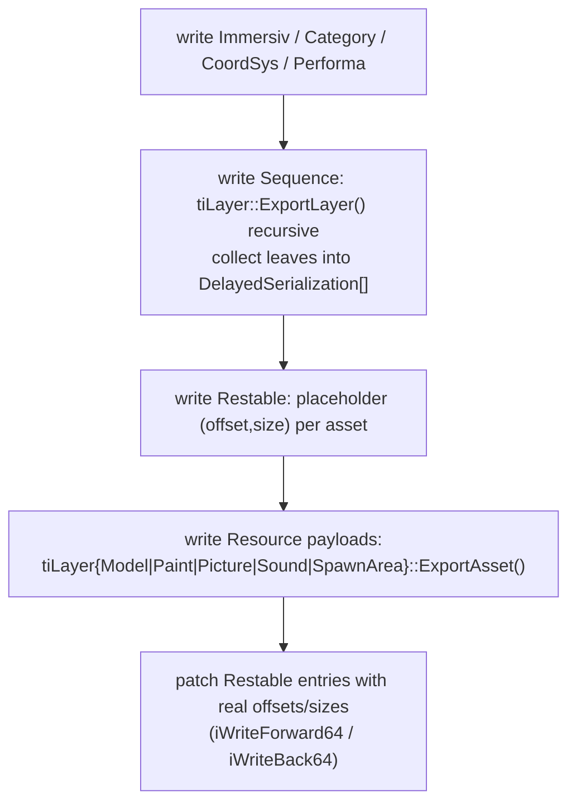

# 4. Import & Export Pipelines

This doc covers the two libraries that move data across the `.imm` boundary:

- **`libImmImporter`** — `fromImmersive`: `.imm` bytes → in-memory document model
- **`libImmExporter`** — `toImmersive`: document model → `.imm` bytes

They are mirror images of each other and share the chunk/versioning conventions from
[02-imm-file-format.md](02-imm-file-format.md).

---

## 4.1 Import: `fromImmersive`

### Public API

`code/libImmImporter/src/fromImmersive/fromImmersive.h`:

```cpp
ImportFromDisk(filename, colorSpace, renderingTechnique, [collector])
ImportFromMemory(buffer, colorSpace, renderingTechnique, [collector])
ImportSceneGraphOnly(filename)   // metadata only — no assets
```

Two parameters shape the result:

- **colorSpace** — `Linear` or `Gamma`; applied as paint/picture assets are decoded.
- **renderingTechnique** — selects how paint layers are materialised: **Static** (pre-rasterized)
  vs **Pretessellated** (pre-triangulated mesh). This is decided *at import time* because it
  changes which concrete `LayerPaint` subclass is built.

`ImportSceneGraphOnly` is the cheap path: it parses the tree and timeline without touching asset
payloads — used to enumerate layers/chapters/bounds before committing to a full load.

### Two-stage loading

Import is intentionally split so the player can stream:



Stage 1 builds the entire scene graph and timeline but **does not** load paint geometry, model
meshes, image pixels, or audio. Stage 2 happens later, driven by the player's streaming budget
(see [05-playback-engine.md](05-playback-engine.md) §5.2), via `fiLayer::LoadAsset` which
delegates to the per-type reader.

### The recursive parse



Files: `fromImmersive.cpp` (chunk dispatch), `fromImmersiveLayer.cpp` (recursive layer + timeline
read, version migration), and `fromImmersiveLayer{Model,Paint,Picture,Sound,SpawnArea}.cpp` (per-type
payload decode). Type strings like `"Quill.Paint"` map to `Layer::Type` values.

### Paint asset decode (example)

`fromImmersiveLayerPaint.cpp` reads, per paint layer: frame count + duration, the
drawing/frame-buffer mapping, then for each drawing the `Element[]` stroke primitives — after
which it computes arc-length/tangents and builds the GPU geometry chunks. Vertex attributes are
de-quantized using `libCompression` (§3.5).

---

## 4.2 Export: `toImmersive`

### Public API

`code/libImmExporter/src/toImmersive/toImmersive.h`:

```cpp
ExportToFile(filename, sequence, opusBitRate, audioType, [progress])
ExportToMemory(buffer,  sequence, opusBitRate, audioType, log, [progress])
```

Note the **audio encode parameters** (`opusBitRate`, `audioType`) — audio is (re)compressed to
Opus on export via `libopusenc`.

### Write order with back-patching

The exporter writes headers and the scene graph first, defers the (large) asset payloads to the
end, then **back-patches** the resource table with the real offsets/sizes once each payload's
final position is known.



`code/libImmExporter/src/toImmersive/toImmersive.cpp` orchestrates this;
`toImmersiveLayer.cpp` writes each `Layerdes` + timeline (always at timeline **v2**) and pushes
leaves onto the delayed list; `toImmersiveUtils.h` has the string/vec/transform writers and the
forward/back size-patching helpers.

### Symmetry table

| Concern | Import (`fromImmersive`) | Export (`toImmersive`) |
|---------|--------------------------|------------------------|
| Entry | `ImportFromDisk/Memory` | `ExportToFile/Memory` |
| Scene graph | `iReadSceneGraph` + `fiLayer::Read` (recursive) | `tiLayer::ExportLayer` (recursive) |
| Timeline | read keys, migrate v0/v1→v2 | write keys at v2 |
| Asset table | `iReadAssetTable` (read offsets) | write placeholders, then back-patch |
| Assets | lazy `fiLayer::LoadAsset` | `tiLayer::*::ExportAsset` (eager, at end) |
| Audio | decode WAV/OGG/OPUS | **encode** to Opus (`opusBitRate`) |

---

## 4.3 Why export exists but is discouraged

The project's own guidance: don't import an `.imm` to re-author it. `.imm` is the optimized,
final delivery form (like JPEG) — round-tripping loses the authoring source's fidelity and
editability. The exporter is primarily for **authoring tools producing `.imm`** (and for tools
that legitimately need to re-serialize), not for an edit loop on already-delivered films.

## 4.4 Cross-references

- The structures being read/written → [02-imm-file-format.md](02-imm-file-format.md)
- Compression primitives used during decode/encode → [03-libImmCore.md](03-libImmCore.md) §3.5
- How the player consumes the imported document and drives lazy asset loads →
  [05-playback-engine.md](05-playback-engine.md)
