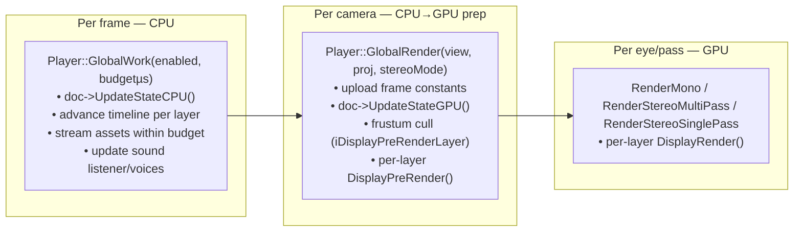
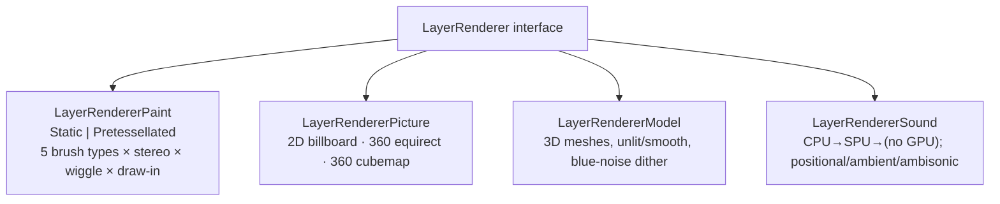
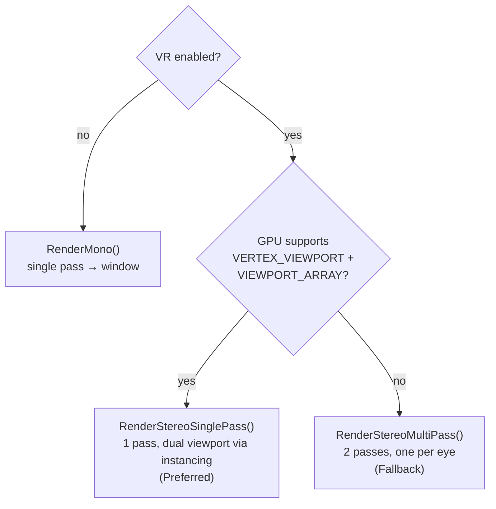
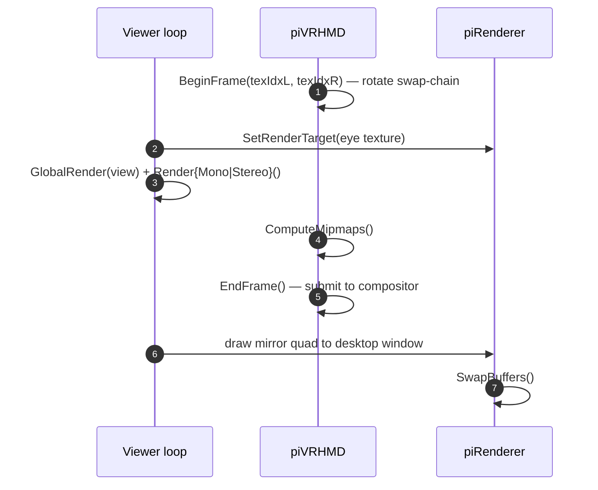
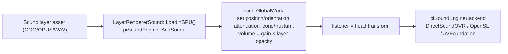
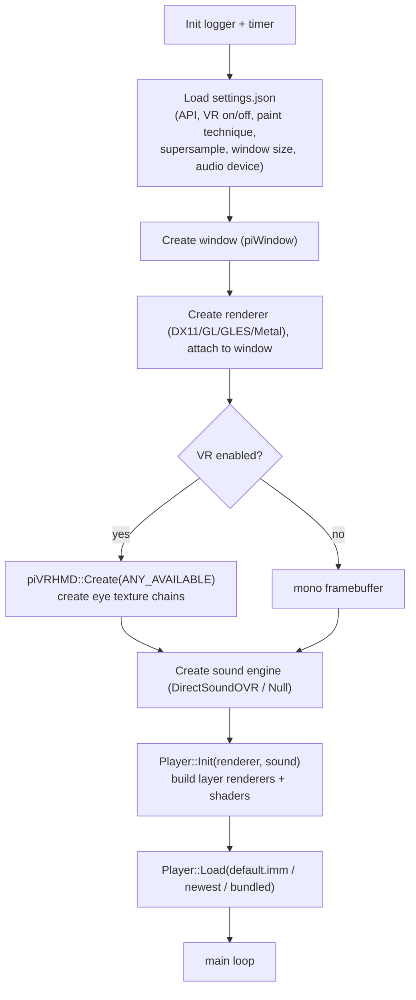
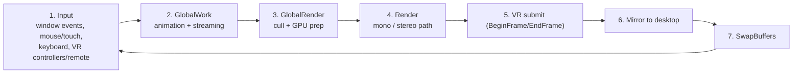

# 5. Playback Engine — libImmPlayer & appImmViewer

This is where a parsed document becomes pixels and spatial sound. Two pieces:

- **`libImmPlayer`** — the engine: the frame loop, per-layer-type renderers, the mono/stereo
  render paths, audio. Renderer-agnostic (drives `libImmCore`'s `piRenderer`).
- **`appImmViewer`** — the native host app: window/swapchain, settings, input, VR setup, and the
  outer loop that calls the engine.

Key files: `code/libImmPlayer/src/player.{h,cpp}`, `document.{h,cpp}`,
`layerRenderers/…`; `code/appImmViewer/src/mymain.cpp`, `viewer/viewer.{h,cpp}`,
`settings.{h,cpp}`.

---

## 5.1 The two-phase frame model

The engine separates **CPU update** from **GPU render**, with a mutex protecting the scene
graph between them. This is what allows animation/streaming to run without tearing the data the
renderer reads.



- `GlobalWork` (`player.cpp` ~L806) runs **once per frame**.
- `GlobalRender` (~L939) runs **once per camera**; it's the CPU-side prep for a viewpoint.
- The `Render*` calls run **per eye/pass** and issue the actual draws.

Shader constant buffers are bound to fixed GPU slots (frame state, layer state, display/eye
state, global resources like a blue-noise dither texture).

---

## 5.2 Document lifecycle & streaming

A `Document` (`document.h`) wraps an imported `Sequence` and runs a small state machine. Assets
move through **three load stages**: CPU (metadata) → GPU (geometry/textures) → SPU (sound into
the audio engine).

```mermaid
stateDiagram-v2
    [*] --> Loading: Player::Load(file/memory) → docId
    Loading --> Ready: scene graph parsed (UpdateStateCPU)
    Ready --> Playing: assets stream in within budget
    Playing --> Paused
    Paused --> Playing
    Playing --> Finished: timeline ends (or loops)
    Finished --> Playing: restart / loop
    Playing --> [*]: Unload(id)
```

The player holds multiple document slots and a command queue. `GlobalWork` is handed a
**microsecond budget** so asset streaming never blows the frame; `UpdateStateCPU`/
`UpdateStateGPU` do incremental work against that budget. Loads are async — the host polls
`GetDocumentState(docId)`.

---

## 5.3 Per-layer renderers

For each `Layer::Type` that draws, the player owns a dedicated renderer implementing a common
`LayerRenderer` interface (`renderLayer.h`). Each exposes the same lifecycle hooks
(`Load*`, `GlobalWork`, `DisplayPreRender`, `DisplayRender`).



| Renderer | How it draws | Notes |
|----------|--------------|-------|
| **Paint** | Brush-stroke meshes in VBOs; many shader permutations | Static = pre-tessellated buffers; Pretessellated = tessellated at runtime. `DrawInTime` drives progressive reveal. |
| **Picture** | Billboard quad / sphere-mapped / cubemap | Viewer-locked pictures follow the head transform. |
| **Model** | Imported mesh draw with materials | Dithered with a blue-noise texture. |
| **Sound** | No GPU work | Loads into `piSoundEngine` (`LoadInSPU`), updates 3D position/volume/attenuation each `GlobalWork`. |

`RenderMono()` (and the stereo variants) simply call `DisplayRender()` on each layer renderer in
turn.

---

## 5.4 VR & stereo render paths

The viewer picks one of three paths based on VR availability and GPU features:



The VR frame lifecycle wraps the render (`mymain.cpp`):



Per-eye matrices come from `piVRHMD::mInfo`: `headToEye = eye.mCamera * invert(head.mCamera)`.
Tracking origin is floor-level. The sound listener is set to the (unscaled) head transform each
frame so spatial audio tracks the viewer.

---

## 5.5 Audio at playback time



Master volume is per-document (`Player::SetDocumentVolume`). The Windows `DirectSoundOVR`
backend is the Audio360/Oculus spatial path. See [03-libImmCore.md](03-libImmCore.md) §3.4.

---

## 5.6 appImmViewer: host app lifecycle



### The main loop



### Content discovery (Android/Quest)

The viewer loads, in order: a `default.imm` in the app's external IMM folder, a folder-based
Quill export, the newest `.imm` in that folder, else the bundled `sample1.imm`. It also accepts
`ACTION_VIEW` intents for `.imm` (copying `content://` URIs into internal storage). See the root
[`README.md`](../../README.md) "Loading IMM files on Android player".

### Input mapping (summary)

| Input | Action |
|-------|--------|
| Keyboard | play/pause, chapter skip, volume |
| Mouse / touch | orbit camera, drag-pan |
| VR grip | play/pause |
| VR thumbstick / remote | navigate / chapter |

Input is handled in `viewer.cpp` (`iHandleGlobalInputs`, `iHandleDocumentInputs`).

---

## 5.7 Shader permutations

DX11 shaders are **pre-compiled at build time** into C++ byte arrays by
`appDX11ShaderCompiler` (paint = 5 brush types × 3 stereo modes × wiggle × draw-in ≈ 60
permutations on desktop). At runtime the renderer indexes into the compiled table. On GL/GLES/
Metal the equivalent shader sources are embedded via CMake custom targets. Details in
[07-build-system.md](07-build-system.md) §7.5.

## 5.8 Cross-references

- The document the player consumes → [02-imm-file-format.md](02-imm-file-format.md)
- The renderer/VR/sound interfaces it drives → [03-libImmCore.md](03-libImmCore.md)
- Exposing the same engine to Unity/Godot → [06-engine-integrations.md](06-engine-integrations.md)
