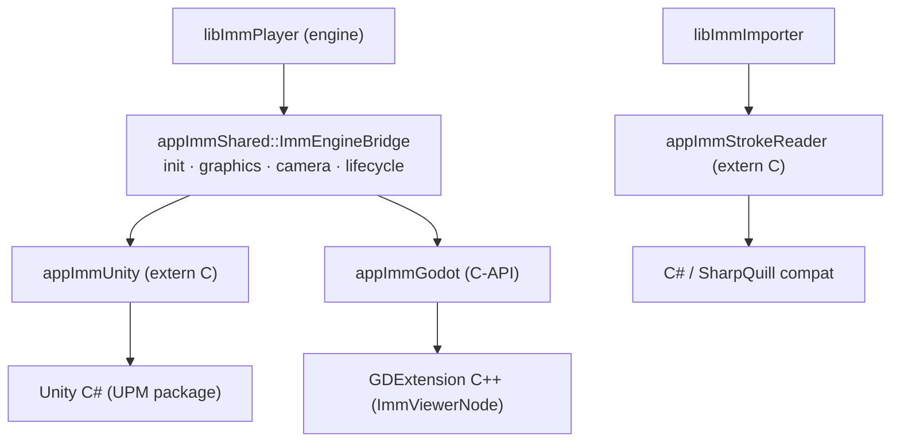
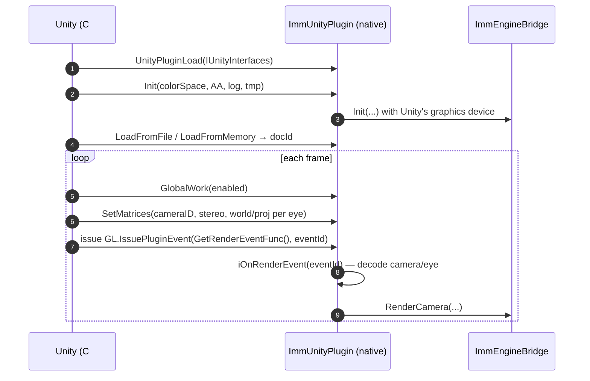
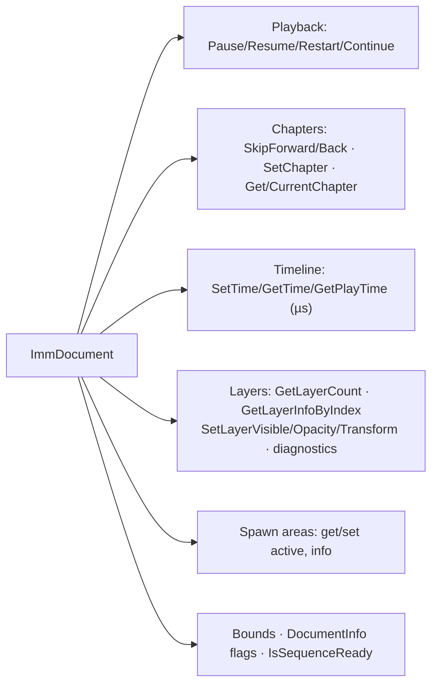
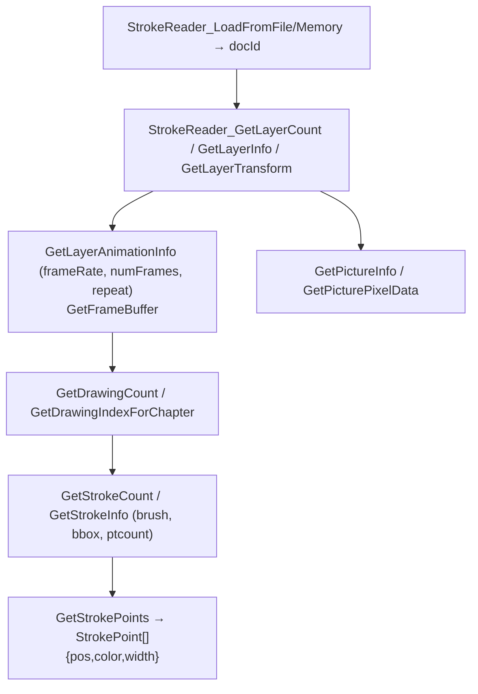
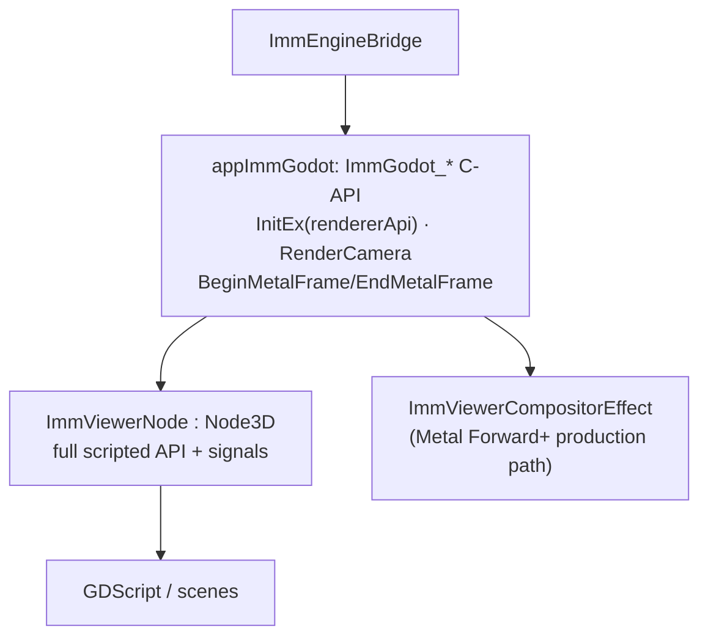
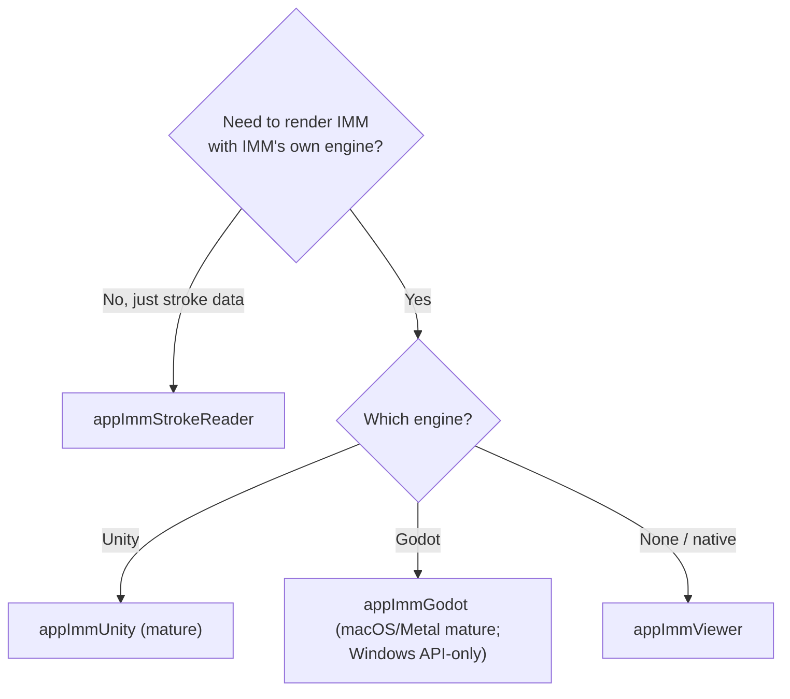

# 6. Engine Integrations — Unity, Godot, StrokeReader

The same `libImmPlayer` engine is surfaced to game engines through native plugins. There are
three distinct integration products plus one shared layer:

| Product | Renders? | For | Boundary |
|---------|----------|-----|----------|
| **appImmUnity** | yes (full player) | Unity | `extern "C"` + P/Invoke |
| **appImmGodot** + GDExtension | yes (full player) | Godot 4.x | C-API + GDExtension C++ |
| **appImmStrokeReader** | **no** (data only) | any engine / open-brush-fast | `extern "C"` |
| **appImmShared** (`ImmEngineBridge`) | — | shared by Unity + Godot | C++ |



---

## 6.1 appImmShared — `ImmEngineBridge`

`code/appImmShared/src/imm_engine_bridge.{h,cpp}` is the engine-agnostic core that both Unity
and Godot build on. It owns renderer creation, the player lifecycle, logging/timing, the sound
backend, and a per-camera matrix cache (up to 256 cameras).

```cpp
struct InitConfig {
    int colorSpace, antialiasing;
    const char *logFileName, *tmpFolderName;
    piRenderer::API rendererApi;   // GL / DX / GLES / Metal
    void *graphicsDevice;          // D3D device or Metal device
    bool initializeRendererOnInit; // deferred init for Android
    // … window/display/vsync/fullscreen flags
};

class ImmEngineBridge {
    bool Init(const InitConfig&);
    bool CompleteGraphicsInitialization();   // deferred (Android)
    void Shutdown();
    void GlobalWork(bool enabled, int budgetMicroseconds);
    void SetCameraMatrices(/* cameraID, stereoType, world/proj per eye */);
    bool RenderCamera(int cameraID, const ViewportInfo&, int eyeID, bool tickSound);
    Player* GetPlayer();  piRenderer* GetRenderer();  piLog* GetLog();
};
```

This is why the Unity and Godot C-APIs look almost identical — they're thin shells over the same
bridge.

---

## 6.2 Unity plugin

### Native boundary

`code/appImmUnity/src/main.cpp` exposes `extern "C"` functions and registers Unity's native
render-plugin callbacks.



The render-event id **bit-packs** camera id + eye id, because Unity's plugin-event callback only
passes a single int. `iOnGraphicsDeviceEvent` handles D3D11/D3D12/GL/Metal device init/teardown.

### C# API (UPM package)

`ImmUnitySampleProject/Packages/com.immersive-foundation.imm-unity/Runtime/`:

- `ImmNativePlugin.cs` — `[DllImport("ImmUnityPlugin")]` P/Invoke wrappers (iOS uses
  `__Internal`).
- `ImmPlayerManager.cs` — singleton: `Initialize()`, `LoadDocument(path) → ImmDocument`,
  per-frame `GlobalWork()`, camera registration, and **two rendering modes** (CommandBuffer vs
  callback) auto-selected by render pipeline.
- `ImmDocument.cs` — the per-document façade. Surface area:



`LayerInfo` carries id/type/parent/visibility/opacity/bounds/childcount plus paint stats
(numDrawings, numFrames, numStrokes) and names — enough to build a runtime layer panel.

---

## 6.3 appImmStrokeReader

`code/appImmStrokeReader/src/main.cpp` — a **render-free** plugin that exposes raw paint
geometry. It depends only on `libImmImporter` (not the player), which is why it builds tiny and
on every platform (incl. iOS as a static lib).

**Why separate?** It feeds **open-brush-fast** and other pipelines that want to draw IMM strokes
with their *own* renderer, and ships a **SharpQuill** compatibility mapping so stroke data lines
up with the Quill data model.



Also exposes `StrokeReader_GetBuildId()` so a downstream Unity project can detect a hot-swapped
DLL. C# binding:
`Packages/com.immersive-foundation.imm-stroke-reader/Runtime/ImmStrokeReader.cs` (+
`SharpQuillCompat.cs`). The root README documents the local DLL hot-copy workflow into a
downstream project's `Library/PackageCache`.

---

## 6.4 Godot port

GDExtension-based (Godot 4.5+), with a C backend (`appImmGodot`) over `ImmEngineBridge` and C++
bindings (`appImmGodotGDExtension`).



- **`ImmViewerNode`** (`imm_viewer_node.cpp`) — a `Node3D` exposing the whole control surface to
  GDScript: load/play/pause/chapters/timeline/layers/spawn-areas/transform/camera-registration,
  plus signals (`document_loaded`, `playback_started`, `spawn_area_changed`, …).
- **`ImmViewerCompositorEffect`** — integrates IMM into Godot's `RenderingDevice` render graph;
  the **production rendering path is macOS Metal (Forward+)**, validated with pixel-level smoke
  tests (can dump a PNG via `IMM_GODOT_VISUAL_SMOKE_PNG`).
- **Build**: SCons + godot-cpp; Windows helper `code/projects/windows/build-godot-extension.ps1`
  stages `imm_godot_extension.dll` + `ImmGodotPlugin.dll` + runtime deps into
  `addons/imm_viewer/bin/windows/...`.

### Status nuance

There are three render tiers, and they are **not equally mature**:

| Tier | Where | Maturity |
|------|-------|----------|
| Script-stub (pure GDScript) | all | validates the scripting API without any native binary |
| OpenGL Compatibility (smoke) | bootstrap | renders, not production-grade |
| Metal Forward+ (visual) | macOS | **production gate** — the CI rendering check |

Windows CI currently validates build/staging/API and the script-stub smoke, **not** native
rendering. Background and plan: `docs/unity-viewer-to-godot-port-plan.md`.

---

## 6.5 Choosing an integration



## 6.6 Cross-references

- The engine these wrap → [05-playback-engine.md](05-playback-engine.md)
- The stroke/layer structures exposed → [02-imm-file-format.md](02-imm-file-format.md)
- Building each plugin → [07-build-system.md](07-build-system.md)
