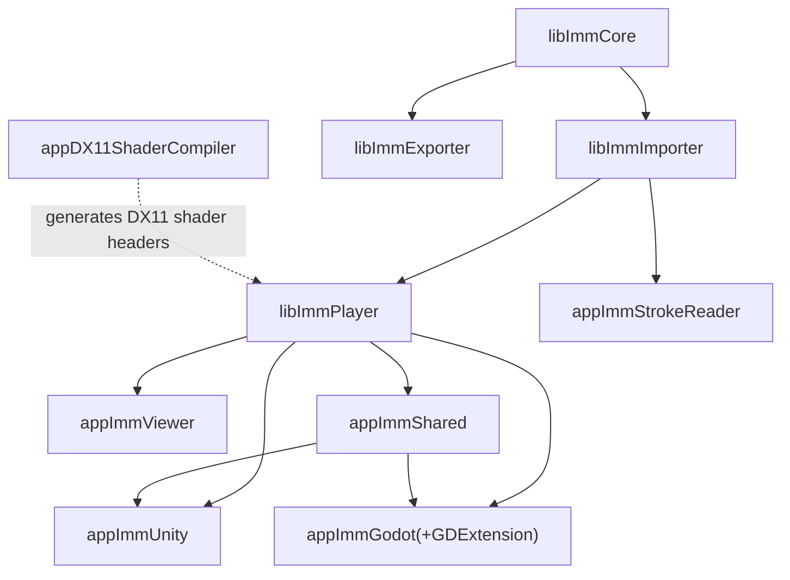
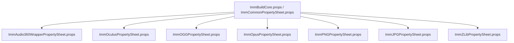
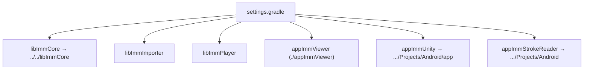
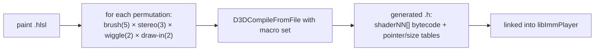

# 7. Build System, Thirdparty & Tooling

This doc maps the multi-platform build. For step-by-step build *commands*, the root
[`BUILDING.md`](../../BUILDING.md) and the `ANDROID_*` docs are authoritative — here we explain
the *structure* and *dependency graph* so the commands make sense.

Project files live in `code/projects/{windows,android,ios,macos}/`.

---

## 7.1 Build graph (shared across platforms)

The library dependency order is the same everywhere; only the toolchain differs.



**Canonical build order:** `libImmCore → libImmImporter → libImmPlayer → app*`.

---

## 7.2 Windows (Visual Studio 2022 / MSBuild)

- **Solution:** `code/projects/windows/imm.sln`. **Always build the `.sln`, never an individual
  `.vcxproj`** — projects use `$(SolutionDir)` in include paths, so a standalone vcxproj build
  fails with header-not-found.
- **Shell gotcha:** run MSBuild from PowerShell/cmd with `/p:` flags; in bash use `-p:` (bash
  strips the leading `/`).

```powershell
msbuild code\projects\windows\imm.sln /p:Configuration=Release /p:Platform=x64 /m
```

- **Configs:** Debug/Release × x64/x86 (x86 maps to x64).
- **Dependency `.props` consolidation** (in `code/projects/windows/`): all third-party include
  paths/libs are centralised so individual projects stay clean.



- **Post-build auto-copy:** `ImmUnityPlugin.dll` and `ImmStrokeReader.dll` are copied into the
  UPM packages under `code/ImmUnitySampleProject/Packages/...`. Built with Windows SDK
  10.0.26100 per the README.

---

## 7.3 Android / Quest (Gradle + NDK + CMake)

`code/projects/android/` — Gradle modules point back at the shared `code/` sources.



- **Toolchain:** NDK 26.1.10909125, C++17, static libc++, JDK 17, SDK 34, AGP 8.5.2, Kotlin
  1.9.22. **ABI:** `arm64-v8a` only. Linker uses 16 KB max/common page size (required for modern
  Android/Quest).
- **VR vs non-VR variants** (the key Android split):

```bash
# Non-VR (phones/tablets)
./gradlew :appImmViewer:assembleDebug -PimmNonVr=ON

# VR (Quest) — build libs into a separate dir, then the VR viewer
./gradlew :libImmCore:assembleDebug :libImmImporter:assembleDebug \
          :libImmPlayer:assembleDebug -PimmBuildDir=build_vr
./gradlew :appImmViewer:assembleDebug -PimmNonVr=OFF -PimmBuildDir=build_vr
```

- **Auto-copy (`copyToUnity` task):** `libImmUnityPlugin.so` and `libImmStrokeReader.so` →
  the UPM packages' `Plugins/Android/.../arm64-v8a`.
- VR uses OpenXR / Oculus Mobile (VrApi); rendering is OpenGL ES.

> The repo's many `ANDROID_*.md` files at root capture the (hard-won) history of getting this
> path working — plugin preload fixes, crash diagnoses, log collection. See §7.6 inventory.

---

## 7.4 macOS / iOS (CMake)

`code/projects/macos/CMakeLists.txt` is shared for both (iOS via `-DCMAKE_SYSTEM_NAME=iOS`).

| Platform | Targets |
|----------|---------|
| **macOS** | `libImmCore` (Metal + OpenGL + AVFoundation), `libImmImporter`, `libImmPlayer`, `ImmUnity` (`.bundle`), `ImmStrokeReader` (`.dylib`), `ImmGodotPlugin` (`.dylib`), `appImmViewerMetal` (standalone Metal player) |
| **iOS** | `libImmCoreMinimal` (no render/window/audio), `libImmImporterMinimal`, `ImmStrokeReader` (static `.a`, arm64) |

```bash
# macOS (StrokeReader)
cmake -S code/projects/macos -B build/macos -DIMM_BUILD_VIEWER=OFF
cmake --build build/macos --target ImmStrokeReader --config Release

# iOS
cmake -S code/projects/macos -B build/ios \
  -DCMAKE_SYSTEM_NAME=iOS -DCMAKE_OSX_SYSROOT=iphoneos -DCMAKE_OSX_ARCHITECTURES=arm64
cmake --build build/ios --target ImmStrokeReader --config Release
```

Deployment target macOS 10.15. CMake custom targets `ShadersModel` / `ShadersPretessellated`
embed GLSL shaders into headers (the GL/Metal analogue of the DX11 shader compiler). All build
targets auto-copy into the UPM package `Plugins/{OSX,macOS,iOS}` folders.

---

## 7.5 The DX11 shader compiler

`code/appDX11ShaderCompiler` is a **build-time tool**, not a runtime component. It compiles an
HLSL source across a matrix of `#define` permutations into a generated C++ header of byte
arrays, which the player links in and indexes at runtime.



≈60 paint permutations on desktop. On GL/GLES/Metal the equivalent is done by the CMake shader
targets (§7.4). This is why a clean Windows build must build the shader compiler before the
player.

---

## 7.6 Thirdparty vendoring

All dependencies are committed under `A:/Github/IMM2/IMM/thirdparty/` for reproducible builds —
the whole point of the icosa-mirror fork. Some (Audio360) are otherwise unobtainable.

| Dependency | Version | Source | Used for |
|------------|---------|--------|----------|
| Facebook Audio360 SDK | 1.7.12 (2019-12-18) | archived (FB removed it) | spatial audio (Windows) |
| Oculus SDK for Windows | 32.0 | meta.com | desktop VR |
| Oculus Platform SDK | 81.0 | meta.com | platform services |
| Oculus Mobile (VrApi) | — | meta.com | Quest VR |
| libogg | 1.3.5 | vcpkg | audio container |
| libvorbis | 1.3.7 | vcpkg | audio codec |
| libopusenc | 0.2.1 | vcpkg | Opus encode (export) |
| opus | 1.5.2 | vcpkg / committed | audio codec |
| libjpeg-turbo | 3.0.4 | vcpkg | JPEG |
| libpng | 1.6.43 / lpng1637 | vcpkg / committed | PNG |
| zlib | 1.3.1 | system / committed | compression |

---

## 7.7 Existing documentation inventory

So you don't duplicate effort, here's what the pre-existing root docs cover. These architecture
docs (this folder) are the *conceptual* layer; the files below are *operational/historical*.

| Doc | Covers |
|-----|--------|
| `README.md` | Project overview, fork history, modules, deps, build quick-start, Android loading |
| `BUILDING.md` | Authoritative build reference (all platforms, validation gates) |
| `docs/android/ANDROID_BUILD_GUIDE.md` / `_QUICK_START` / `_INDEX` / `_PROJECT_SUMMARY` | Android build setup, deploy, module map |
| `docs/android/ANDROID_BUILD_STATUS.md` / `docs/history/BUILD_STATUS_SUMMARY.md` / `BUILD_SUCCESS.md` / `BUILD_CONFIGURATION_HISTORY.md` | Build status snapshots + history |
| `docs/android/ANDROID_PLUGIN_FIX_PRELOAD.md` / `ANDROID_UNITY_PLUGIN_FIX.md` / `UNITY_ANDROID_PLUGIN_*` / `PLUGIN_COMPARISON.md` | Native/Unity plugin fixes for Android |
| `docs/android/ANDROID_DEBUG_LOGS_ADDED.md` / `HOW_TO_COLLECT_ANDROID_LOGS.md` / `docs/history/DIAGNOSIS_REPORT.md` | Debugging Quest/Android |
| `docs/history/AUDIO_EXTRACTION_GUIDE.md` | Extracting audio from `.imm` |
| `docs/android/SDK_DOWNLOAD_GUIDE.md` | Obtaining the SDKs (if not using vendored copies) |
| `docs/history/COMPARISON_UPSTREAM_VS_ICOSA.md` | What the icosa fork changed vs upstream |
| `docs/history/PROJECT_CONTEXT.md` / `PROJECT_NOTES.md` / `SESSION_NOTES.md` | Working notes |
| `docs/history/TEST_RESULTS.md` / `VR_TEST_RESULTS.md` | Test outcomes |
| `code/docs/viewer_readme.md` / `viewer_settings.md` | Native viewer usage + settings.json |
| `code/docs/unity-viewer-to-godot-port-plan.md` | Godot port plan/status |
| `code/docs/{ANDROID_PLUGIN_FIX,CRASH_FIX,IMPLEMENTATION_COMPLETE}.md` | Historical fix notes |
| `code/docs/fig1.png` / `fig2.png` | Original dependency-hierarchy diagrams (referenced by README) |

## 7.8 Cross-references

- What each built module *is* → [01-overview.md](01-overview.md)
- What the engine does at runtime → [05-playback-engine.md](05-playback-engine.md)
- Plugin specifics (Unity/Godot/StrokeReader) → [06-engine-integrations.md](06-engine-integrations.md)
