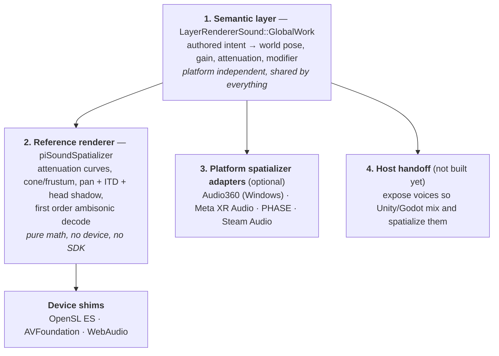

# 8. Audio

Audio in IMM is entirely native. Unity, Godot and the web player never see an `AudioClip` or
an `AudioSource` — the engine decodes, spatializes and mixes, and (today) owns its own output
device on every platform.

This document is the contract for anyone porting IMM to a new platform. The short version:
**the spatial model lives above the platform boundary, and a new platform should only ever
have to write a device shim.**

## 8.1 What the format carries

`LayerSound` (`code/libImmImporter/src/document/layerSound.h`) is a scene-graph layer like any
other — it has a transform, it can be parented, animated and instanced. It stores:

| Field | Meaning |
|-------|---------|
| **Type** | `Flat` (head-locked), `Ambisonic` (360 bed), `Positional` (3D point source) |
| **Attenuation** | `None` / `Linear` / `Logarithmic`, with min and max distances |
| **Modifier** | `None` / `DirectionalCone` / `DirectionalFrustum` — directional emitters, positional only |
| **gain** | authored, static |
| **volume** | animatable from the timeline |
| **loop, play, paused, offset, forceRestart** | transport, driven by the layer timeline |
| payload | WAV or OPUS, in the on-demand asset table |

Because a sound is a layer, a positional emitter parented to an animated group follows it, and
its attenuation distances are multiplied by the layer's world scale — scaling a scene scales
its audio falloff.

## 8.2 The four layers

**Layer 1** already existed and is correct. `LayerRendererSound::GlobalWork`
(`code/libImmPlayer/src/layerRenderers/layerRendererSound/layerRendererSound.cpp`) computes
`finalVolume = masterVolume × layerVolume × gain × modifierVolume` every frame and pushes
world position/orientation and attenuation into `piSoundEngine`.

**Layer 2** is `code/libImmCore/src/libSound/piSoundSpatializer.{h,cpp}`. It is the single
place where authored intent becomes gains and filter coefficients. It has no device, OS or SDK
dependency, which is what lets it be tested on any host — see §8.5.

## 8.3 Division of labour (important)

The player and the engine each own part of the gain, and doubling up is a real bug:

| Gain term | Applied by |
|-----------|-----------|
| master × layer volume × gain | the player, folded into `SetVolume` |
| **directional modifier** | the player, via `piSoundEngine::ComputeModifiers` |
| **distance attenuation** | the **engine/mixer** |
| pan, ITD, head shadow | the engine/mixer |

So a mixer calls `ComputeBinaural` (which includes attenuation) but must **not** apply
`ComputeModifier` again — the volume it was handed already contains it.

## 8.4 Parity with Audio360

Windows uses the Facebook Audio360 SDK and keeps doing so — it works and content has been
mixed against it. The attenuation and modifier math in `piSoundSpatializer` is a deliberate
port of that backend's behaviour so every other platform agrees with it:

- Logarithmic attenuation reproduces Audio360's `factor = 5 / log2(max/min)` (6 dB per doubling
  at factor 1), landing 30 dB down at the maximum distance, with `maxDistanceMute` semantics.
- The cone uses angular-space smoothstep, not cosine space.
- The frustum projects the listener onto the emitter's Z=1 plane and squares the result.
- **The frustum returns hard silence behind the emitter and ignores `attenOut`.** This is a
  quirk, it is reproduced on purpose, and it is commented in both places. Do not "fix" it in
  one backend only — that is exactly how platforms drift apart.

## 8.5 Conformance

`code/projects/windows/run-audio-conformance.ps1` builds and runs both suites on the host — no
headset, no Unity, no Android toolchain, because neither the spatializer nor the mixer policy
touches a device:

| Suite | Covers |
|-------|--------|
| `libImmCore/src/libSound/tests/test_piSoundSpatializer.cpp` | attenuation curves, cone and frustum behaviour, panning symmetry and power preservation, near-field collapse and continuity, the gain+pan reduction used by output stages that have nothing better, and that an ambisonic bed follows both the head and the bed layer's own orientation |
| `libImmPlayer/src/tests/test_soundMix.cpp` | the host mixer's fader/bus/mute/solo precedence, and that an untouched mixer is exactly unity |

Any new backend or adapter should be checked against these numbers before anyone puts a
headset on. Without this, a new platform silently regresses to "plays, sounds fine to me",
which is how the codebase ended up with two independently stubbed backends.

This matters most where a backend *cannot* be built on the machine doing the work — the Apple
gain+pan reduction is exercised here precisely because `piSoundEngineAVFoundation.mm` needs a
mac to compile.

## 8.6 Platform status

| Platform | Device | Spatialization | Notes |
|----------|--------|----------------|-------|
| Windows | Audio360 | Audio360 (full, incl. HOA) | the quality reference |
| Quest / Android | OpenSL ES + `AMediaCodec` decode | `piSoundSpatializer` | pan + ITD + head shadow + first-order bed decode; not HRIR convolution yet |
| macOS / iOS | AVFoundation (`AVAudioPlayer`) | `piSoundSpatializer`, reduced to gain + pan | attenuation and cone/frustum are exact; no ITD, no head shadow, no ambisonic — see below |
| Web | WebAudio | HRTF `PannerNode` | separate implementation; no ambisonic |
| visionOS / tvOS | — | — | not ported; see §8.9 |

### Apple specifics

`AVAudioPlayer` exposes only a gain and a stereo pan, so the Apple backend takes the parts of
the shared model it can express — the exact attenuation curve and the lateral position, via
`piSoundSpatializer::ReduceToStereoPan` — and loses the rest. Because the head moves without
anyone touching a voice, the backend re-evaluates every voice from `Tick()`.

Getting the rest (HRTF, ambisonic, room acoustics) means moving off `AVAudioPlayer` to
`AVAudioEngine` + `AVAudioEnvironmentNode`, or to PHASE. That is a rewrite of the backend's
output stage, not a change to the model above it — which is the point of the layering.

### Quest specifics

- Ambisonic beds are decoded as **AmbiX (ACN/SN3D)** for 4 and 9 channel content. 10 and 11
  channel beds are Facebook's TBE layout, which is *not* AmbiX — those fall back to flat
  playback using their head-locked stereo pair (the last two channels), which is correct,
  rather than playing channels 0/1 which is spatial content.
- Positional voices are collapsed to mono before spatializing — an emitter is a point.
- Rendering parameters are recomputed once per audio callback block and interpolated across
  it. Stepping them per block clicks.

### Killswitches

Following the one-change-one-killswitch rule:

| Flag | Effect |
|------|--------|
| `IMM_AUDIO_NO_SPATIAL` | drop straight back to flat, unspatialized playback (Quest and Apple) |
| `IMM_AUDIO_AMBISONIC_FUMA` | decode 4 channel beds as FuMa instead of AmbiX (Quest) |

Set via the device flag file (`imm_debug_flags.txt`), which the C# side pushes into the
process environment at boot.

## 8.7 Host lifecycle

The engine owns its own output device, so **nothing the host does to its own audio system
reaches these voices** — Unity's `AudioListener.pause` does nothing here.
`ImmPlayerManager` therefore calls `PauseAllSounds` / `ResumeAllSounds` on
`OnApplicationPause` and `OnApplicationFocus`.

On Android these suspend the whole engine rather than stamping `mPaused` on each voice: doing
it per voice would lose what the timeline authored, because the player caches the pause state
it last pushed and would see no change to re-assert.

## 8.8 The host mixer

Per-layer fader, mute, solo and a small set of buses, on top of whatever the document
authored. The composition is one pure function in `libImmPlayer/src/soundMix.h`; everything
else is bookkeeping around it.

- The mixer **multiplies** the authored volume, it never replaces it, so the timeline keeps
  animating underneath a fader.
- It rides in on `masterVolume` inside `Player::iGlobalWorkLayer`. That keeps it entirely
  within the player instead of spreading it through every layer renderer's shared
  `GlobalWork` signature.
- **Mute wins over solo**, including on the same layer. While anything is soloed, everything
  not soloed is silent.
- Solo is **scoped to the document** (`Document::GetSoundSoloCount`) and recounted rather than
  incremented, so a soloed layer in a document that unloads can never leave the rest of the
  mix silenced.
- Bus faders are **global to the player**, not per document.

C# side: `ImmDocument.GetSoundLayers()` returns the sound layers with their mixer state, and
`SetSoundLayer{Volume,Mute,Solo,Bus}` / `ImmDocument.SetSoundBusVolume` drive it. Enumeration
reuses `GetLayerInfoByIndex` filtered on `LayerType.Sound`.

Remember that sound layers are deliberately exempt from the visibility gate (`player.cpp`,
`lt != Layer::Type::Sound`), so hiding a layer does **not** silence it — that is what mute is
for.

## 8.9 Known gaps / next steps

1. **No HRIR convolution.** The current renderer is pan + ITD + head shadow, which is a large
   improvement over centred mono but is not true binaural, and does not resolve front/back.
   The MIT-licensed HRIRs and FIR filter in `facebookincubator/Audio360` drop in behind
   `ComputeBinaural` without changing any caller.
2. **Apple is gain + pan only**, because `AVAudioPlayer` offers nothing else. Moving the
   output stage to `AVAudioEngine`/PHASE gets HRTF, ambisonic and room acoustics, and covers
   macOS, iOS, tvOS and visionOS in one adapter.
3. **No host handoff.** Until layer 4 exists, IMM audio cannot reach Unity's AudioMixer, the
   Meta XR Audio spatializer, or visionOS's OS-level spatializer — and on visionOS a
   self-managed output stream is actively wrong, because it fights the system renderer. Note
   that the host mixer in §8.8 is *not* a substitute for this: it balances IMM's own voices,
   it does not put them inside the host's mix graph.
4. **Device parameters are hardcoded** at 48 kHz / 512 frames with no query of the device's
   native rate or optimal burst size.
5. **The listener is one frame stale.** `Player::GlobalWork` pushes `SetListener` *after*
   running the layer traversal, so `ComputeModifiers` sees the previous frame's head pose.
   Harmless at walking speed, worth knowing at travel speed.
