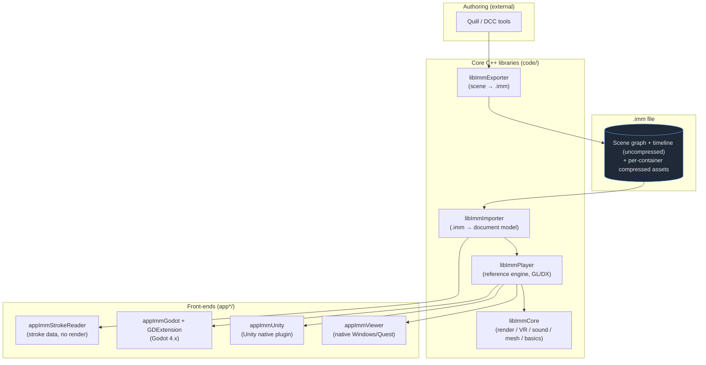

# IMM Architecture Documentation

This folder is a deep, diagram-driven guide to how the **IMM (Immersive Media)** codebase
works — from the on-disk file format up through the reference player and the Unity / Godot
engine integrations.

> **Audience:** developers who need to understand, build, extend, or port IMM.
> For *how to build*, see the root [`BUILDING.md`](../../BUILDING.md). For Android specifics,
> see the `ANDROID_*` docs at the repo root. This set is about *how the system is designed*.

## What IMM is, in one paragraph

IMM is an **API-neutral runtime delivery format for immersive 3D/2D animated content** plus a
**reference engine** that plays it. Think "JPEG for VR films": authoring tools (e.g. Quill)
export a scene — paint strokes, 3D models, 360° panoramas, positioned 2D pictures, spatial
audio, a scene graph and an animation timeline — into a single compressed `.imm` file. The
engine streams that file and renders it in true 6-DoF, on the desktop (DX11/OpenGL), on Quest
(OpenGL ES + OpenXR/Oculus), and inside Unity and Godot via native plugins. This repo is a
**vendored, reproducible-build fork** (icosa-mirror lineage) with all SDKs committed.

## Reading order

| # | Doc | What it covers |
|---|-----|----------------|
| 1 | [01-overview.md](01-overview.md) | Project history, the module map, top-level data flow, the 30-ft view |
| 2 | [02-imm-file-format.md](02-imm-file-format.md) | The `.imm` binary container, chunk signatures, the in-memory document/scene-graph model, layer taxonomy, animation timeline |
| 3 | [03-libImmCore.md](03-libImmCore.md) | The cross-platform foundation: renderer abstraction, VR/HMD, sound, mesh, compression, basics |
| 4 | [04-import-export-pipeline.md](04-import-export-pipeline.md) | `fromImmersive` (read) and `toImmersive` (write) pipelines, deferred asset loading, versioning |
| 5 | [05-playback-engine.md](05-playback-engine.md) | libImmPlayer + appImmViewer: the frame loop, per-layer renderers, VR stereo paths, audio |
| 6 | [06-engine-integrations.md](06-engine-integrations.md) | Unity plugin, StrokeReader, Godot GDExtension, the shared `ImmEngineBridge` |
| 7 | [07-build-system.md](07-build-system.md) | Windows/Android/macOS/iOS build graphs, thirdparty vendoring, the shader compiler |

## The whole system on one page

## Conventions in these docs

- File references use repo-relative paths under `code/` and are clickable, e.g.
  `code/libImmPlayer/src/player.cpp`.
- Diagrams are [Mermaid](https://mermaid.js.org/) fenced blocks — they render on GitHub and in
  most Markdown viewers. No image build step required.
- Where a fact came from a specific source location it is cited inline so you can verify and
  go deeper.

> ⚠️ **Accuracy note:** these docs were assembled by reading headers and representative
> implementation files, not every line. Treat line numbers as "as of this writing" — code
> moves. When in doubt, the header (`.h`) is the contract.
